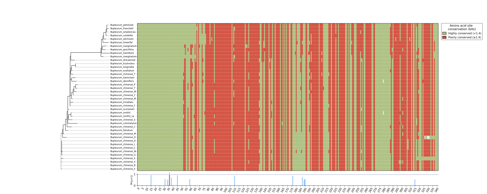

# Demo 1：单基因位点保守性与正选择分析（以rbcL基因为例）
---
## **1. 输入准备**

运行本示例前，需准备以下文件：

### **CDS 多序列比对文件**
**文件名示例**：`rbcl.fasta`  
**要求：**
- 每条序列长度必须为 **3 的倍数**；
- **不含提前终止密码子**（末端终止可忽略）；<br>
- 建议将简并碱基（W、S、M、K、R、Y、B、D、H、V）统一替换为 `N`；
- 序列名称应 **避免空格**；


> CDS 可通过内置模块 `geneminer` 提取，也可使用使用增强版 geneminer2（外部工具）批量生成。

---

### **系统发育树文件**（可选）
**文件名示例**：`rbcl.treefile`  
- 若未提供，程序会自动调用 **IQ-TREE** 推断系统发育树；
- 若提供系统发育树，需保证 **系统发育树物种名与序列名一致**。

---

### **输出目录**
**输出目录示例**：`result_dir`  

---

## **2. 运行命令**

```bash
gene2struct siteview \
  -f rbcl.fasta \ # 必填：输入多序列比对
  -o result_dir \ # 必填：输出目录
  -o result_dir \ # 必填：输出目录
  [-t rbcl.treefile] \ # 可选：Newick 树文件
  [-n CHAR_LIMIT] \  # 可选：树上叶节点名称显示的最大字符数（默认：20）
  [-g SPECIES] \ # 可选：外类群物种名（可写多个，用空格分隔），用于定根
  [--thr THRESHOLD] # 可选：保守性阈值（基于列熵，默认 1.4；越小越严格）
  [--site] # 可选：启用位点层面的 PAML 分析（运行 M0/M3/M7/M8 并整合 BEB 结果）
```

该命令将自动执行以下步骤：  
	- 检查 CDS 格式（长度、终止密码子、简并碱基等）；  
	- 若未提供系统发育树，则自动运行 IQ-TREE；  
	- 基于 evo2 模型计算每个位点的保守性评分；  
	- 自动运行 PAML 的多模型分析（M0、M3、M7、M8）；  
	- 整合 BEB（Bayes Empirical Bayes） 结果，识别潜在正选择位点；  
	- 绘制综合可视化图像并导出。
	
---

## **3. 输出结果**

```bash
result_dir/
 ├── file_input/       # 输入与中间文件（PHYLIP / IQTREE / 比对文件等）
 ├── evo_output/       # evo2 计算结果（位点保守性评分）
 ├── paml_output/      # PAML 分析输出（M0M3 / M7M8 模型）
 └── scripts.png          # 综合可视化图：系统发育树 + 位点保守性 + 正选择标注
```

---

## **4. 结果解读**

**系统发育树与位点保守性热图**
  
	- 绿色区域表示高度保守位点（熵值 ≥ 1.4），反映序列在该区域的高度一致性。  
	- 红色区域表示高变位点（熵值 < 1.4），代表进化过程中存在较强的变异。  
	- 下方轨道图展示了 BEB（Bayes Empirical Bayes）推断得到的潜在正向选择位点分布（*/** 表示该位点的正向选择后验概率 P(ω>1) > 95%/99%）
